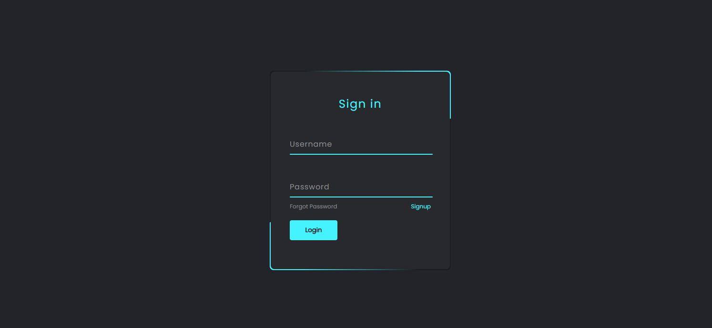

# 10 CSS Projects for Beginners from easy to hard.

|                 **Project No.**                  |                                    **Project Name**                                    |                     **Live Demo**                      |
| :----------------------------------------------: | :------------------------------------------------------------------------------------: | :----------------------------------------------------: |
|          [1](#01-responsive-image-grid)          |                   [Responsive Image Grid](#01-responsive-image-grid)                   | [Live Demo](https://responsive-image-grid.vercel.app/) |
| [2](#02-a-beautiful-page-using-linear-gradients) | [A Beautiful Page Using Linear Gradients](#02-a-beautiful-page-using-linear-gradients) |   [Live Demo](https://linear-gradients.vercel.app/)    |
|     [3](#03-a-beautiful-animated-login-form)     |         [A Beautiful Animated Login Form](#03-a-beautiful-animated-login-form)         |                                                        |
|                        4                         |                                                                                        |                                                        |
|                        5                         |                                                                                        |                                                        |
|                        6                         |                                                                                        |                                                        |
|                        7                         |                                                                                        |                                                        |
|                        8                         |                                                                                        |                                                        |
|                        9                         |                                                                                        |                                                        |
|                        10                        |                                                                                        |                                                        |

# 01. Responsive Image Grid

### Difficulty: Easy(2/10)

### You Will Learn

- CSS Grid Layout
- How to make a collection of images responsive.

### Project Description

This project shows how to utilize **CSS Grid Layout** to responsive a collection of images like _pinterest_.

### Project Screenshot

_Click the image to view Live Project_

### Live Project Link

[Live Project Link](https://responsive-image-grid.vercel.app/)

### Video Explanation

Coming Soon...

### Project Source Codes

[Project Source Codes](./01-responsive-image-grid/)

[<h3 align="center">Go to Top</h3>](#10-css-projects-for-beginners-from-easy-to-hard)

# 02. A Beautiful Page Using Linear Gradients

### Difficulty: Easy(2/10)

### You Will Learn

- CSS Linear Gradients
- How to create a beautiful page using linear gradients.

### Project Description

This project shows how to utilize **CSS Linear Gradients** to create a beautiful simple page.

### Project Screenshot

_Click the image to view Live Project_

### Live Project Link

[Live Project Link](https://linear-gradients.vercel.app/)

### Video Explanation

Coming Soon...

### Project Source Codes

[Project Source Codes](./02-a-beautiful-page-using-linear-gradient/)

[<h3 align="center">Go to Top</h3>](#10-css-projects-for-beginners-from-easy-to-hard)

# 03. A Beautiful Animated Login Form

### Difficulty: Easy(3/10)

### You Will Learn

- CSS 2D and 3D Animation.
- How to use css tricks to create a beautiful animated form.

### Project Description

This is a login page built with only HTML and CSS. After completing this project, you'll learn how to use css animations and some commonly used property to create a beautiful login form. Probably you know all of the css properties and their definations, but maybe you don't know how to use them to create some beautiful UI. This project is gonna teach the way!

### Project Screenshot

_Click the image to view Live Project_

### Live Project Link

[Live Project Link](https://travelerabdulalim.github.io/animated-login-form/)

### Video Explanation

Coming Soon...

### Project Source Codes

[Project Source Codes](./03-a-beautiful-animated-login-form/)

[<h3 align="center">Go to Top</h3>](#10-css-projects-for-beginners-from-easy-to-hard)
